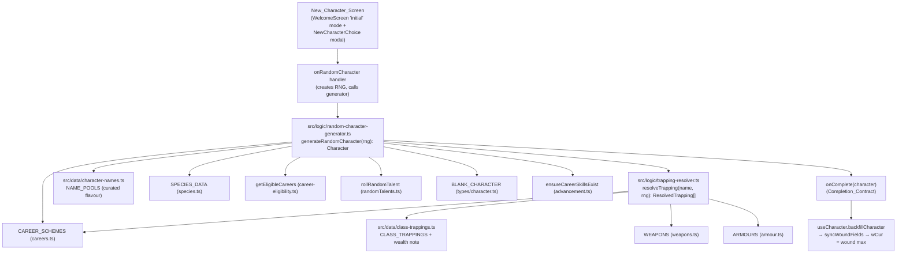

# Design Document: Random Character Generator

## Overview

This feature adds a one-click **"Create Random Character"** path to the new-character flow. It
introduces a pure, deterministic generation module plus two curated data files, a trapping-resolution
helper, and an entry-point control on the existing New_Character_Screen surfaces. The generated
`Character` is handed to the **same** `onComplete(character: Character)` contract the wizard uses, so
persistence, wound backfill, and navigation are unchanged.

The design is deliberately **additive and non-invasive**:

- It mirrors the proven patterns already in `CharacterWizard.buildCharacter` (species → career →
  characteristics → skills → talents → gear assembly) and the `usePersonalDetailsGeneration` RNG seam,
  rather than inventing new conventions.
- It reuses existing helpers (`getEligibleCareers`, `rollRandomTalent`, `ensureCareerSkillsExist`,
  `resolveSkillChar`-style resolution, `SPECIES_DATA`, `CAREER_SCHEMES`, `WEAPONS`, `ARMOURS`).
- It never sets `wCur`; it relies on the existing backfill path in `src/hooks/useCharacter.ts`
  (`backfillCharacter` / `syncWoundFields`) that initialises current wounds to the wound maximum.

### Rulebook compliance

Every mechanic traces to the WFRP4e Core Rulebook, Chapter 1 "Character Creation"
(`docs/WarhammerFantasyRoleplay4e.md`). Key confirmed citations:

- **Random Species Table** (Core p.24): `01–90 Human, 91–94 Halfling, 95–98 Dwarf, 99 High Elf,
  00 Wood Elf`; `+20 XP` for accepting the roll.
- **Random Class and Career** (Core p.30–31): `+50 XP` for keeping a raw random Class & Career roll.
- **Characteristics** (Core p.33): roll 2d10 per characteristic; Step 2 rearrange = `+25 XP`;
  add species modifier from the Attributes Table.
- **Fate/Resilience/Fortune/Resolve, Movement, Wounds** (Core p.33–34): base Fate/Resilience + Extra
  Points split; Fortune = Fate, Resolve = Resilience; Movement→Walk(×2)/Run(×4); Wounds = SB + 2×TB +
  WPB (Halflings exclude SB).
- **Advance Characteristics** (Core p.34): 5 Advances across the three advance-scheme characteristics.
- **Species Skills and Talents** (Core p.35): choose 3 skills at +5 and 3 skills at +3; resolve talent
  "A or B" choices; fill Random Talent slots, reroll duplicates.
- **Career Skills and Talents** (Core p.35): 40 Advances across the 8 level-1 career skills, max 10 per
  skill; choose 1 of 4 career talents.
- **Class Trappings** (Core p.37) and **Career Trappings** (Core p.36): starting gear.
- **Starting Wealth** (Core p.37): Brass 2d10 / Silver 1d10 / Gold 1 GC **per Status Level (Standing)**.

Curated **name pools** have no mechanical effect and are flagged as a non-rulebook flavour extension
(Req 2.4, 13.2).

### Resolved open question — career-randomization Bonus XP = +50

Total `Bonus_XP = 20 (species) + 25 (characteristic rearrange) + 50 (career) = 95 XP`, left unspent
(`xpCur = xpTotal = 95`, `xpSpent = 0`).

**This is an explicit interpretation, recorded per Req 13.3.** Core p.30–31 awards +50 XP for keeping a
raw `d100` roll on the Random Class & Career table. This generator instead rolls species first, then
picks a random career from `getEligibleCareers(species)`. We treat the eligible-career roll as
equivalent to the Random Class & Career roll for XP purposes. This also matches the existing
`CharacterWizard` "Roll Random Career" behaviour (`careerXP = careerRolled ? 50 : 0`), keeping both
creation paths consistent. Flagged as a judgment call, not an invented value.

## Architecture

### Module layout



**New files**

| File | Responsibility |
|------|----------------|
| `src/logic/random-character-generator.ts` | Pure `generateRandomCharacter(rng: RNG): Character`. Orchestrates the full build. Deterministic under a seeded RNG (Req 1.5). |
| `src/logic/trapping-resolver.ts` | `resolveTrapping(entry, rng)` — maps a granted trapping string to concrete `WeaponItem` / `ArmourItem` / `Trapping`, resolving "A or B" and generic entries (Req 11.3–11.7). |
| `src/data/character-names.ts` | `NAME_POOLS: Record<string, string[]>` keyed by species, with a `FALLBACK_NAME_POOL`. Curated flavour, no mechanical effect (Req 2.2–2.4, 13.2). |
| `src/data/class-trappings.ts` | `CLASS_TRAPPINGS: Record<string, string[]>` (Core p.37) + the starting-wealth-per-Status-Level rule documented in a comment (Core p.37). |

**Modified files**

| File | Change |
|------|--------|
| `src/components/shared/WelcomeScreen.tsx` | Add a "Create Random Character" button to `'initial'` mode; add an `onRandomCharacter` prop that produces a `Character` and calls the existing completion handler. |
| `src/components/shared/NewCharacterChoice.tsx` | Add the same control, surfaced through a new `onRandomCharacter` prop. |
| `src/App.tsx` | Wire both entry points: build the RNG, call `generateRandomCharacter`, and route the result through the existing `onWizardComplete`-equivalent path (`saveCharacter(manager.createCharacter(character.name), character)` for WelcomeScreen; the `handleNewCharWizard` equivalent for the modal). |

### The RNG seam

The generator takes an injectable RNG so it is deterministic and unit-testable, mirroring the
`usePersonalDetailsGeneration` seam (which isolates `Math.random`). The RNG is a function returning a
float in `[0, 1)` — identical in shape to `Math.random` — so production simply passes `Math.random` and
tests pass a seeded generator.

```ts
/** Random-number source: a function returning a float in [0, 1), like Math.random. */
export type RNG = () => number;

// Dice helpers built on the RNG (Core p.33 for 2d10; p.24/p.30 for d100):
function rollD10(rng: RNG): number;   // 1..10
function roll2d10(rng: RNG): number;  // 2..20
function rollD100(rng: RNG): number;  // 1..100
function pick<T>(rng: RNG, items: T[]): T; // uniform choice; items must be non-empty
```

A tiny deterministic seeded RNG (e.g. a mulberry32 / LCG implementation) lives in the **test** files
only — production code never seeds. This matches Req 1.5 ("identical Character on every invocation with
that same seeded RNG") without adding a seeding dependency to the app.

> Design decision: using `() => number` (not `{ next(): number }`) because it is drop-in compatible
> with `Math.random` and with the existing personal-details `Math.random` call sites, minimising
> surface area and making the production call site `generateRandomCharacter(Math.random)`.

### Preview surface decision

**Recommendation: no preview; generate then hand off directly** (the simplest path, Req 1.2). The
button generates a complete `Character` and immediately invokes the Completion_Contract; the character
then opens in the sheet, where all calculated totals already have their breakdown Tooltips (the
`calculated-totals` steering rule is satisfied by the existing sheet UI). Because the entry-point
control displays **no calculated totals**, Req 15.3 applies and the feature carries **no additional
Tooltip obligation**. If a confirmation surface is added later, any total shown there must use the
shared `src/components/shared/Tooltip.tsx` with a labelled additive breakdown (Req 15.1–15.2); that is
out of scope for the first version.

## Components and Interfaces

### `generateRandomCharacter(rng: RNG): Character`

The single public entry point. Pure (no I/O, no `Date.now`, no module-level `Math.random`). Returns a
fully-assembled `Character` built from a `structuredClone(BLANK_CHARACTER)`, exactly as
`CharacterWizard.buildCharacter` does.

Internal helpers (not exported, or exported only for unit testing):

| Helper | Purpose | Core cite |
|--------|---------|-----------|
| `rollSpecies(rng)` | d100 → Species_Data key; Human → `"Human / Reiklander"` | p.24 |
| `pickEligibleCareer(rng, species)` | random career from `getEligibleCareers(species)` filtered to those with `level1` | p.30–31 |
| `rollCharacteristics(rng)` | raw 2d10 values (2..20) per characteristic | p.33 |
| `assignByRearrange(rolls, scheme)` | highest rolls → advance-scheme chars (rearrange method) | p.33 |
| `distributeCharAdvances(rng, scheme)` | 5 advances across advance-scheme chars | p.34 |
| `pickSpeciesSkills(rng, speciesSkills)` | 3×+5 and 3×+3, no overlap | p.35 |
| `resolveSpeciesTalents(rng, speciesData, existing)` | fixed + "A or B" + random slots w/ dup reroll | p.35 |
| `distributeCareerSkillAdvances(rng, careerSkills)` | 40 advances, ≤10 each | p.35 |
| `pickCareerTalent(rng, careerTalents)` | 1 of 4 | p.35 |
| `buildDerived(speciesData, rng)` | Fate/Fortune/Resilience/Resolve, Movement, woundsUseSB, extra-points split | p.33–34 |
| `assembleGear(rng, careerLevel1, className)` | career + class trappings → `resolveTrapping` | p.36–37 |
| `rollStartingWealth(rng, statusString)` | parse "Silver 2" → wealth | p.37 |
| `buildPersonalDetails(rng, species)` | age/height/hair/eyes via personal-details logic; Dwarf feature from d100 table, else Feature_Pool | p.24–25; dwarfguide p.40 |

### `resolveTrapping(entry: string, rng: RNG): ResolvedTrapping[]` (trapping-resolver.ts)

Maps a single granted trapping string to zero or more concrete items. Returns a discriminated result so
the caller routes each into `weapons`, `armour`, or `trappings`.

```ts
export type ResolvedTrapping =
  | { kind: 'weapon'; item: WeaponItem }
  | { kind: 'armour'; item: ArmourItem }
  | { kind: 'trapping'; item: Trapping };
```

Resolution order (Req 11.3–11.7):

1. **Ambiguous "A or B" / "A and B"** — split on ` or ` / ` and `. For " or " pick one deterministically
   via `rng` (or via the AMBIGUOUS_MAP when the entry is a known category). For " and " resolve each
   part and return all.
2. **Known generic category** — look up `AMBIGUOUS_MAP` (e.g. `"Melee Weapon (Basic or Cavalry)"` →
   `"Hand Weapon"`, `"Trade Tools"` → named trapping). Judgment-call entries are flagged in the map.
3. **Exact weapon** — `WEAPONS.find(w => w.name === resolved)` → `{ kind: 'weapon' }` with the full stat
   block (Req 11.5).
4. **Exact armour** — `ARMOURS.find(a => a.name === resolved)` → `{ kind: 'armour' }` with the full stat
   block (Req 11.6).
5. **Fallback** — `{ kind: 'trapping' }` with `{ name, enc: '0', quantity: 1 }` (Req 11.7). Quantity
   phrases like "10 arrows" may set a sensible quantity; otherwise 1.

### Entry-point controls (UI)

Both `WelcomeScreen` ('initial' mode) and `NewCharacterChoice` gain a focusable `<button type="button">`
labelled **"Create Random Character"** with an accessible name conveying purpose (Req 14.1–14.2),
styled with the existing button classes (`styles.secondaryBtn`/`primaryBtn`). It participates in the
same focus handling the existing controls use (Req 14.3). Clicking calls
`onRandomCharacter(generateRandomCharacter(Math.random))` via the parent, which routes to the existing
completion path.

## Data Models

### `RNG`

```ts
export type RNG = () => number; // float in [0, 1), Math.random-compatible
```

### Name_Pool (`src/data/character-names.ts`)

```ts
/**
 * Curated, lore-appropriate given names per species. FLAVOUR ONLY — no mechanical
 * effect; NOT a rulebook table (Req 2.4, 13.2). Names drawn loosely from Core p.37-39
 * naming guidance for inspiration only.
 */
export const NAME_POOLS: Record<string, string[]>; // keyed by SPECIES_OPTIONS entries
export const FALLBACK_NAME_POOL: string[];          // used when a species has no dedicated pool (Req 2.3)
```

- Must provide a pool for **every** `SPECIES_OPTIONS` entry (Req 2.2). Dwarf/High-Elf variant keys
  (e.g. `"Dwarfs (Karaz-a-Karak)"`, `"High Elves (Caledor)"`) either get their own pool or map to a
  base-species pool via a documented key-normalisation; any key still unmatched falls back to
  `FALLBACK_NAME_POOL` (Req 2.3).

### Feature_Pool (`src/data/distinguishing-features.ts`)

```ts
/**
 * Curated, lore-appropriate distinguishing features per species group. FLAVOUR ONLY —
 * no mechanical effect; NOT a rulebook table (Req 16.7). Used only for NON-Dwarf species;
 * Dwarf features come from the official d100 alternate table (dwarfguide.md p.40).
 */
export const FEATURE_POOLS: Record<string, string[]>; // keyed by non-Dwarf SpeciesGroup
export const FALLBACK_FEATURE_POOL: string[];          // used when a group has no dedicated pool (Req 16.6)
```

Provide a pool for every non-Dwarf `SpeciesGroup` (`Human`, `Halfling`, `High_Elf`, `Wood_Elf`, `Ogre`);
`resolveFeaturePool(group)` returns the dedicated pool or `FALLBACK_FEATURE_POOL`.

### Class_Trappings (`src/data/class-trappings.ts`)

```ts
/**
 * General starting Trappings by Class (Core p.37 "Class Trappings"). Dice-rolled
 * quantities (e.g. Academics' "1d10 sheets of Parchment") are expressed as entries
 * the Trapping_Resolver/generator can roll via RNG.
 */
export const CLASS_TRAPPINGS: Record<string, string[]>;
```

Seeded from Core p.37 (verbatim list):

| Class | Trappings |
|-------|-----------|
| Academics | Clothing, Dagger, Pouch, Sling Bag (Writing Kit + 1d10 Parchment sheets) |
| Burghers | Cloak, Clothing, Dagger, Hat, Pouch, Sling Bag (Lunch) |
| Courtiers | Dagger, Fine Clothing, Pouch (Tweezers, Ear Pick, Comb) |
| Peasants | Cloak, Clothing, Dagger, Pouch, Sling Bag (Rations 1 day) |
| Rangers | Cloak, Clothing, Dagger, Pouch, Backpack (Tinderbox, Blanket, Rations 1 day) |
| Riverfolk | Cloak, Clothing, Dagger, Pouch, Sling Bag (Flask of Spirits) |
| Rogues | Clothing, Dagger, Pouch, Sling Bag (2 Candles, 1d10 Matches, Hood or Mask) |
| Warriors | Clothing, Hand Weapon, Dagger, Pouch |

The starting-wealth rule (Core p.37) is documented alongside: `Brass → 2d10 d per Standing; Silver →
1d10 ss per Standing; Gold → 1 GC per Standing`.

### Career_Trappings source

Career level-1 trappings come from `CareerScheme.level1.trappings` (`CareerLevel.trappings?: string[]`).
**Edge case (confirmed in data):** most Core careers in `src/data/careers.ts` carry **no** `trappings`
array at level 1 (only some supplement careers — Badger Rider, Field Warden, Ghost Strider — do). The
generator therefore treats `level1.trappings ?? []` as the career trappings source and relies on
**Class_Trappings** (always present) for baseline gear. This is a faithful mapping of the existing data
shape — the generator does not invent per-career trapping tables that are absent from the data.

### Trapping_Resolver resolution map (`AMBIGUOUS_MAP`)

```ts
/** Maps ambiguous/generic granted-trapping strings to a concrete item name
 *  resolvable in WEAPONS/ARMOURS, or to a named trapping. */
export const AMBIGUOUS_MAP: Record<string, string>;
```

Seed entries (⚠ = judgment call, flagged per Req 13):

| Granted entry | Resolves to | Target data | Note |
|---------------|-------------|-------------|------|
| `Hand Weapon` | `Hand Weapon` | WEAPONS | exact |
| `Dagger` | `Dagger` | WEAPONS | exact |
| `Melee Weapon (Basic or Cavalry)` | `Hand Weapon` | WEAPONS | ⚠ pick a concrete Basic weapon |
| `Leather Jack` | `Leather Jack` | ARMOURS | exact |
| `Boiled Leather Breastplate` | `Leather Jerkin` | ARMOURS | ⚠ closest Boiled-Leather body armour |
| `Trade Tools` / `Trade Tools (as Trade)` | `Trade Tools` | TRAPPING | named trapping (exists in TRAPPING_LIST) |
| `Longbow and 10 arrows` | `Bow` (+ `Arrow (12)` ×1) | WEAPONS + TRAPPING | ⚠ split; nearest ranged weapon |
| `Sling with 10 stones` | `Sling` (+ `Stone Bullet (12)`) | WEAPONS/TRAPPING | ⚠ nearest match |

Unlisted entries fall through to exact-name lookup, then to a named trapping (Req 11.7). Every ⚠ entry
is a documented interpretation, not an invented mechanic (Req 13.3).

### Character assembly shape

The returned `Character` is `structuredClone(BLANK_CHARACTER)` with these fields populated (`_v: 8`):

- Identity: `name`, `species`, `class`, `career`, `careerLevel`, `careerPath`, `status` (Req 1.3–1.4,
  3.x, 4.3).
- `chars[k] = { i: roll + speciesMod, a: careerAdvance, b: 0 }` (Req 5.3, 5.6).
- `move = { m, w: m*2, r: m*4 }` (Req 9.4).
- `fate`, `fortune`, `resilience`, `resolve`, `speciesExtraPoints`, `woundsUseSB` (Req 9.1–9.6).
- `speciesSkills`, `speciesTalents` (Req 6.4, 7.5); `bSkills`/`aSkills` with applied advances
  (Req 6.1–6.3, 8.1–8.4); `talents` (Req 7.1–7.4, 8.3).
- `weapons`, `armour`, `trappings`, `wD`/`wSS`/`wGC` (Req 11.x).
- `xpCur = xpTotal = 95`, `xpSpent = 0` (Req 10.x).
- **`wCur` left at 0** — backfill sets it to the wound max (Req 12.1–12.2).

## Algorithm Detail

Each step cites the Core page it implements.

### 1. Species — Random Species Table (Core p.24)

`rollD100(rng)` → map: `≤90 → "Human / Reiklander"`, `91–94 → "Halfling"`, `95–98 → "Dwarf"`,
`99 → "High Elf"`, `100 → "Wood Elf"`. (Verbatim from `CharacterWizard.handleRandomSpecies`.) Award +20
XP (p.24).

### 2. Eligible career (Core p.30–31)

`careers = getEligibleCareers(species).filter(c => CAREER_SCHEMES[c]?.level1)` then `pick(rng, careers)`.
The `level1` filter excludes High-Elf elite careers that start at level 2 (Smith-Priest of Vaul, Storm
Weaver, Loremaster of Hoeth). Set `class`, `career`, `careerPath = picked`, `careerLevel =
level1.title`, `status = level1.status`. Award +50 XP (interpretation above).

### 3. Characteristics: roll, rearrange, modify (Core p.33)

1. Roll `rolls = [roll2d10]` (one raw 2d10 per characteristic). Characteristics are stored on the raw scale as `2d10 + species modifier` (Core p.33 Attributes Table); there is no ×10 scaling.
2. **Rearrange** so highest rolls land on advance-scheme chars (`level1.characteristics`):
   - Sort the ten rolled values descending.
   - Assign the largest values, in order, to the advance-scheme characteristics (in the scheme's listed
     order). The scheme has three such chars (Core p.34), so the top 3 rolls go there.
   - Assign the remaining rolls to the remaining seven characteristics in canonical
     `CHARACTERISTIC_KEYS` order.
   - **Tie/leftover handling:** sorting is stable; equal values are assigned in encounter order, so the
     result is fully determined by the roll sequence (keeps Req 1.5 determinism). No value is dropped or
     duplicated — it is a permutation of the ten rolled values.
3. `chars[k].i = assignedRoll[k] + SPECIES_DATA[species].chars[k]` (Attributes Table modifier, p.33).
   Award +25 XP (rearrange, p.33 Step 2).

### 4. Characteristic advances (Core p.34)

Distribute exactly 5 advances across the three advance-scheme chars only (Req 5.4–5.5). **Distribution
rule:** round-robin across the scheme characteristics in listed order (indices `0,1,2,0,1` for 5
advances over 3 chars → `2,2,1`). Deterministic and scheme-order-based (no RNG needed), guaranteeing the
total is exactly 5 and nothing lands outside the scheme. Written to `chars[k].a`.

> Edge case: if a scheme lists more or fewer than three chars (data variance), the round-robin still
> distributes exactly 5 across whatever advance-scheme chars exist, never exceeding that set.

### 5. Species skills — 3×+5 / 3×+3 (Core p.35)

From `SPECIES_DATA[species].skills`, shuffle via RNG and take the first 3 for +5 and the next 3 for +3
(no overlap, Req 6.1). Application mirrors `buildCharacter` (Req 6.2–6.3):

- If the skill matches a `bSkills` entry → add advances there (Basic skill).
- Else if it matches an existing `aSkills` entry → add advances there.
- Else push a new `aSkills` entry `{ n, c: resolveSkillChar(n), a }` with the correct linked
  characteristic (reusing the wizard's `resolveSkillChar` fallback pattern, promoted to a shared helper
  or duplicated locally).

Set `speciesSkills = SPECIES_DATA[species].skills` (Req 6.4).

> Edge case — specialisation skills needing a linked characteristic (e.g. `Trade (Any)`, `Stealth
> (Any)`): `resolveSkillChar` already resolves the base name to a characteristic; wildcard `(Any)`
> entries are added as-is with the resolved characteristic (the player picks the specialisation later),
> consistent with existing wizard behaviour.

### 6. Species talents — fixed, choices, random slots (Core p.35)

For each entry in `SPECIES_DATA[species].talents`:
- Plain entry → grant it (Req 7.1).
- `"A or B"` → split on ` or `, `pick(rng, options)` (Req 7.2).

Then fill `randomTalentSlots` (if any) by `rollRandomTalent(rollD100(rng))`; **if the result duplicates
any already-granted talent, reroll** until unique (Req 7.3–7.4). The dup-reroll terminates because the
Random Talent table has 36 distinct outcomes and species grant far fewer talents than 36, so a
non-duplicate always exists (bounded loop with a safety cap documented in code). Set `speciesTalents =
SPECIES_DATA[species].talents` (Req 7.5). Talents pushed with `{ n, lvl: 1, desc }` and de-duplicated by
name (mirrors `buildCharacter`).

### 7. Career skills — 40 advances, ≤10 each (Core p.35)

Across the 8 `level1.skills`, distribute exactly 40 advances with each skill ≤10 (Req 8.1–8.2).
**Distribution rule:** start every career skill at a base and top up to 40 while respecting the cap.
With 8 skills and a 10-cap, `8 × 5 = 40` fits exactly, so the baseline is **+5 to each of the 8 career
skills** (also the rulebook's own worked example, Core p.35: "enough to add 5 Advances to every Career
Skill"). This deterministically yields sum 40 and max 5 (≤10). Applied with the same Basic/Advanced
resolution as species skills. Then `ensureCareerSkillsExist(char, careerSkills)` guarantees every
non-wildcard career skill exists on the character (Req 8.4), reusing the existing helper.

> Edge case — fewer/more than 8 career skills (data variance): distribute 40 as evenly as possible
> (`floor(40/n)` each, remainder spread one-per-skill from the top), clamped so no skill exceeds 10. If
> `n < 4` the 10-cap could prevent reaching 40; in that case the generator allocates up to the cap on
> each and documents the shortfall rather than exceeding the cap (cap compliance takes precedence per
> Core p.35). Core careers always have 8 skills, so this is a defensive branch.

### 8. Career talent (Core p.35)

`pick(rng, level1.talents)` → one talent, pushed as `{ n, lvl: 1, desc }` (Req 8.3).

### 9. Derived attributes (Core p.33–34)

- `move = { m: speciesData.move, w: move*2, r: move*4 }` (Req 9.4).
- **Extra-points split policy:** `speciesData.extraPoints` split between Fate and Resilience. Policy:
  assign `floor(extraPoints / 2)` to Fate and the remainder to Resilience (odd point → Resilience).
  Deterministic, exactly consumes all extra points (Req 9.3). Rationale: a simple, fixed, legal split;
  it is a creation choice the rules leave to the player, so a fixed policy is a documented interpretation
  (not an invented mechanic — the *total* is fixed by the Attributes Table).
  - `fate = speciesData.fate + fateExtra`; `fortune = fate` (Req 9.1).
  - `resilience = speciesData.resilience + resilienceExtra`; `resolve = resilience` (Req 9.2).
- `speciesExtraPoints = speciesData.extraPoints` (Req 9.6).
- `woundsUseSB = speciesData.woundsUseSB` (Req 9.5; Halflings `false`).

### 10. Gear assembly (Core p.36–37)

Collect `entries = [...(level1.trappings ?? []), ...CLASS_TRAPPINGS[className]]`. For each, call
`resolveTrapping(entry, rng)` and route results into `char.weapons` / `char.armour` / `char.trappings`
(Req 11.1–11.7). Weapons/armour get full stat blocks copied from `WEAPONS`/`ARMOURS`.

### 11. Starting wealth (Core p.37)

Parse `status` (`"Tier Standing"`, e.g. `"Silver 2"`). Split on whitespace → `tier ∈ {Brass, Silver,
Gold}`, `standing = parseInt(...)`.

- Brass: `wD = sum of (standing × 2d10)` → i.e. roll `2 × standing` d10 and sum (per Status Level).
- Silver: `wSS = sum of (standing × 1d10)`.
- Gold: `wGC = standing` (1 GC per Status Level).

> Edge case — unparseable status string: if the tier is unrecognised or the standing is `NaN`, grant
> zero wealth (`wD = wSS = wGC = 0`) and leave a code comment; do not throw. This keeps generation total
> and avoids inventing a wealth value (Req 13.3).

### 11a. Personal details (Core p.24–25; dwarfguide p.40)

Reuse the existing pure personal-details logic (`src/logic/personal-details.ts`), routing every roll
through the generator's RNG seam instead of `Math.random` (Req 16.1, 16.9). Build a d10 helper from the
seam: a d10 is `Math.floor(rng() * 10) + 1`.

- `group = getSpeciesGroup(species)` (Req 16.2). If `group` is undefined (shouldn't happen for Core
  species), skip personal details and leave the fields at their blank defaults — no throw.
- **Age** (Req 16.1): roll `AGE_FORMULAS[group].diceCount` d10s via the seam → `generateAge(group, dice)`.
  (For High Elves, use the default `AGE_FORMULAS` tier — the generator does not prompt for a tier;
  documented as the full-auto default.)
- **Height** (Req 16.1, 16.3): roll `HEIGHT_FORMULAS[group].diceCount` d10s; for Human, if
  `humanHeightNeedsBonus([d1, d2])` roll one more d10 and pass it as the bonus die; call
  `generateHeight(group, dice, bonusDie?)`.
- **Hair** (Req 16.1): roll 2d10, sum → `lookupHairColour(group, sum)`.
- **Eyes** (Req 16.1, 16.4): roll 2d10, sum → `lookupEyeColour(group, sum)`. For High Elf / Wood Elf,
  roll a second 2d10 → `lookupEyeColour` again and combine via `formatVariegatedEyes(first, second)`.
- **Distinguishing feature** (Req 16.5, 16.6): if `group === 'Dwarf'`, roll d100 via the seam →
  `lookupDwarfAlternateTable(roll, species).feature` (the regional modifier applies only to hair/eye,
  not the feature — already handled by the helper). Otherwise `pick(rng, resolveFeaturePool(group))`
  from the curated Feature_Pool.

Written to `char.age` (string), `char.height` (string), `char.hair`, `char.eyes`,
`char.distinguishingFeature`.

> Rules-compliance note: age/height/hair/eyes and the Dwarf feature are rulebook-sourced (Core p.24–25;
> dwarfguide p.40). Non-Dwarf distinguishing features have **no** rulebook table, so they are a curated
> flavour Feature_Pool explicitly flagged as non-rulebook with no mechanical effect (Req 16.7), mirroring
> the Name_Pool treatment.

### 12. XP and wounds

`xpTotal = xpCur = 95`, `xpSpent = 0` (Req 10.x). **`wCur` is NOT set** — the generator leaves it 0 so
`backfillCharacter` → `syncWoundFields` → `calculateTotalWounds` initialises it to the wound max
(Core p.36–37; Req 12.1–12.2). The generator only ensures `chars`, `woundsUseSB`, and `speciesExtraPoints`
feed that calculation correctly.

## Edge Cases (summary)

| Edge case | Handling | Req |
|-----------|----------|-----|
| Species with no dedicated name pool (variant keys) | Normalise to base-species pool; else `FALLBACK_NAME_POOL` | 2.3 |
| Advance scheme ≠ 3 chars | Round-robin 5 advances over whatever advance-scheme chars exist | 5.4 |
| Specialisation skill needing linked char | `resolveSkillChar` base-name resolution; wildcard added as-is | 6.3 |
| Random-talent dup reroll | Bounded loop; 36-entry table ≫ talents granted, always terminates | 7.4 |
| Career skills ≠ 8 | Even split with 10-cap; cap compliance wins over reaching 40 | 8.1–8.2 |
| Unparseable status string | Zero wealth, commented, no throw | 11.8/13.3 |
| Item not in WEAPONS/ARMOURS | Store as named trapping, quantity 1 | 11.7 |
| High-Elf elite careers lacking `level1` | Excluded by `level1` filter | 4.2 |

## Correctness Properties

*A property is a characteristic or behavior that should hold true across all valid executions of a
system — essentially, a formal statement about what the system should do. Properties serve as the
bridge between human-readable specifications and machine-verifiable correctness guarantees.*

This feature is a strong fit for property-based testing. `generateRandomCharacter` is a pure function
whose output must be **rules-legal for every seed**, and the trapping resolver and species-mapping are
pure lookups over large input spaces. Tests drive the generator with a **seeded** RNG so each property
runs ≥100 distinct seeds.

After prework, redundant criteria were consolidated: the many per-field invariants decompose a single
headline "rules-legal character" guarantee, so overlapping checks (e.g. 5.4+5.5+5.6, 6.1+6.2+6.3,
9.1+9.2+9.3, 10.1–10.4, 11.1+11.5+11.6+11.7) are merged into comprehensive properties below.

### Property 1: Determinism under a seeded RNG

*For any* seed, invoking `generateRandomCharacter` twice with freshly-seeded RNGs built from that seed
produces two deeply-equal `Character` objects.

**Validates: Requirements 1.5**

### Property 2: Well-formed identity

*For any* seed, the generated character has `_v === 8`; `species` is a defined `SPECIES_DATA` key;
`career` is a defined `CAREER_SCHEMES` key with a defined `level1`; and `class === scheme.class`,
`careerLevel === scheme.level1.title`, `careerPath === career`, `status === scheme.level1.status` are
all non-empty and mutually consistent.

**Validates: Requirements 1.3, 1.4, 4.3**

### Property 3: Species mapping follows the Random Species Table

*For any* d100 roll in 1..100, the species-mapping function returns exactly the table band species
(`≤90 → "Human / Reiklander"`, `91–94 → "Halfling"`, `95–98 → "Dwarf"`, `99 → "High Elf"`,
`100 → "Wood Elf"`), and for any seed the generated `species` is one of these keys.

**Validates: Requirements 3.1, 3.2, 3.3**

### Property 4: Career is eligible and startable

*For any* seed, `career ∈ getEligibleCareers(species)` and `CAREER_SCHEMES[career].level1` is defined.

**Validates: Requirements 4.1, 4.2**

### Property 5: Characteristic initials are in-range rolls plus species modifier

*For any* seed and every characteristic `k`, `chars[k].i − SPECIES_DATA[species].chars[k]` is an integer
in `[2, 20]` (a valid 2d10 result), and each `chars[k]` has numeric `i`/`a`/`b` with `b === 0`.

**Validates: Requirements 5.1, 5.3, 5.6**

### Property 6: Rearrange assigns the highest rolls to advance-scheme characteristics

*For any* seed, the multiset of rolled values assigned across the ten characteristics equals the multiset
of values actually rolled (a permutation), and the minimum rolled value assigned to an advance-scheme
characteristic is `>=` the maximum rolled value assigned to any non-scheme characteristic.

**Validates: Requirements 5.2**

### Property 7: Characteristic advances are legal

*For any* seed, the sum of `chars[k].a` over all characteristics is exactly 5, and every characteristic
with `a > 0` is a member of the career's advance-scheme characteristics.

**Validates: Requirements 5.4, 5.5**

### Property 8: Species skill allocation is legal

*For any* seed, the species-skill step selects 6 distinct skills drawn from `SPECIES_DATA[species].skills`
— 3 receiving +5 advances and 3 (disjoint) receiving +3 — where each selected skill that matches a Basic
skill name receives its advances on the Basic entry, and each non-Basic selection appears as an Advanced
skill whose linked characteristic equals `resolveSkillChar(name)`.

**Validates: Requirements 6.1, 6.2, 6.3**

### Property 9: Species lists are copied verbatim

*For any* seed, `char.speciesSkills` equals `SPECIES_DATA[species].skills` and `char.speciesTalents`
equals `SPECIES_DATA[species].talents`.

**Validates: Requirements 6.4, 7.5**

### Property 10: Species talents resolved with unique results

*For any* seed, every fixed (non-choice) species talent is present on `char.talents`; for every
`"A or B"` entry exactly one option is present; the number of random talents added equals
`randomTalentSlots` and each is a valid Random Talent table result; and all talent names on the
character are distinct (duplicate random rolls are rerolled).

**Validates: Requirements 7.1, 7.2, 7.3, 7.4**

### Property 11: Career skill advances are legal and complete

*For any* seed, the advances applied across the eight level-1 career skills sum to exactly 40 with no
single career skill receiving more than 10, and every non-wildcard level-1 career skill exists on the
character after allocation.

**Validates: Requirements 8.1, 8.2, 8.4**

### Property 12: Exactly one career talent is chosen

*For any* seed, exactly one of the four level-1 career talents appears on `char.talents`.

**Validates: Requirements 8.3**

### Property 13: Derived Fate/Resilience and Movement

*For any* seed, `fortune === fate` and `resolve === resilience`;
`(fate − SPECIES_DATA[species].fate) + (resilience − SPECIES_DATA[species].resilience) ===
SPECIES_DATA[species].extraPoints` with both extra components `>= 0`; `move.m === SPECIES_DATA[species].move`,
`move.w === 2 × move.m`, `move.r === 4 × move.m`; `woundsUseSB === SPECIES_DATA[species].woundsUseSB`;
and `speciesExtraPoints === SPECIES_DATA[species].extraPoints`.

**Validates: Requirements 9.1, 9.2, 9.3, 9.4, 9.5, 9.6**

### Property 14: Bonus XP is 95 and unspent

*For any* seed, `xpCur === 95`, `xpTotal === 95`, and `xpSpent === 0`.

**Validates: Requirements 10.1, 10.2, 10.3, 10.4**

### Property 15: Granted trappings resolve to items present on the character

*For any* seed, every resolvable entry from the career level-1 trappings and from `CLASS_TRAPPINGS[class]`
resolves to at least one item that appears in the character's `weapons`, `armour`, or `trappings`.

**Validates: Requirements 11.1, 11.2**

### Property 16: Ambiguous and generic trappings resolve to a single concrete item

*For any* `"A or B"` entry the resolver yields exactly one chosen option's resolution, and *for every*
entry in `AMBIGUOUS_MAP` the resolver returns the mapped concrete item (as the correct `weapon`/`armour`/
`trapping` kind).

**Validates: Requirements 11.3, 11.4**

### Property 17: Resolved weapons and armour carry full stat blocks

*For any* seed, every generated weapon whose name matches an entry in `WEAPONS` has `group`, `enc`,
`rangeReach`, `damage`, and `qualities` equal to that `WEAPONS` entry; every generated armour whose name
matches an entry in `ARMOURS` has `locations`, `enc`, `ap`, `qualities`, and `armourType` equal to that
`ARMOURS` entry; and any resolved item matching neither is stored as a trapping with `quantity >= 1`.

**Validates: Requirements 11.5, 11.6, 11.7**

### Property 18: Starting wealth matches Status Tier and Standing

*For any* seed, parsing `status` into `(tier, standing)` yields wealth in only the matching denomination,
bounded by the tier's dice rule: Brass `wD ∈ [2 × standing, 20 × standing]` with others zero; Silver
`wSS ∈ [standing, 10 × standing]` with others zero; Gold `wGC === standing` with others zero.

**Validates: Requirements 11.8**

### Property 19: Name belongs to the species' name pool

*For any* seed, the generated `name` is a member of the resolved name pool for `species` — the dedicated
`NAME_POOLS` entry (after key normalisation) when one exists, otherwise `FALLBACK_NAME_POOL` — and is
never empty.

**Validates: Requirements 2.1, 2.3**

### Property 20: Every species has a resolvable, non-empty name pool

*For every* species in `SPECIES_OPTIONS`, resolving its name pool (dedicated, normalised, or fallback)
yields a non-empty list.

**Validates: Requirements 2.2**

### Property 21: Wounds are left for backfill and compute to a correct maximum

*For any* seed, the raw generator output has `wCur === 0`; and after running the existing
`backfillCharacter` path, `wCur` equals `calculateTotalWounds(chars, woundsUseSB, hardyLevel,
woundMultiplier)` and is greater than 0.

**Validates: Requirements 12.1, 12.2**

### Property 22: Personal details are populated and race-appropriate

*For any* seed, `age`, `height`, `hair`, `eyes`, and `distinguishingFeature` are all non-empty strings;
`hair` is a value from `HAIR_COLOUR_TABLE[getSpeciesGroup(species)]` and `eyes` is composed only of
value(s) from `EYE_COLOUR_TABLE[getSpeciesGroup(species)]`; for a Dwarf, `distinguishingFeature` is a
`feature` value from the Dwarf d100 alternate table; for a non-Dwarf, `distinguishingFeature` is a member
of the resolved Feature_Pool for its species group.

**Validates: Requirements 16.1, 16.2, 16.4, 16.5, 16.6**

### Property 23: Personal details are deterministic under a seeded RNG

*For any* seed, two generations with freshly-seeded RNGs built from that seed produce identical `age`,
`height`, `hair`, `eyes`, and `distinguishingFeature` (a consequence of Property 1, asserted explicitly
for the personal-details fields).

**Validates: Requirements 16.8, 16.9**

## Error Handling

The generator is pure and must **never throw** during normal operation; it degrades gracefully so a
"Create Random Character" click always yields a usable character.

| Situation | Handling |
|-----------|----------|
| Species has no eligible careers with `level1` | Cannot occur for Core species (all five have many); defensively, if the filtered list is empty the generator throws a developer-facing `Error` naming the species, since silently returning an invalid character would violate Property 4. This is a programming/data error, not user input. |
| `pick` called on an empty array | Guarded; callers only pass non-empty lists. A defensive guard throws a clear developer error rather than returning `undefined`. |
| Unparseable `status` string | Zero wealth (`wD = wSS = wGC = 0`), commented; no throw (Property 18 bounds hold trivially). |
| Trapping name not in `WEAPONS`/`ARMOURS` and not in `AMBIGUOUS_MAP` | Stored as a named trapping, quantity 1 (Property 17). |
| Random-talent dup-reroll | Bounded loop with a safety cap (e.g. 100 attempts); the 36-entry table guarantees termination well within the cap. If the cap is somehow hit, the slot is skipped rather than looping forever. |
| Specialisation/wildcard skills | `resolveSkillChar` resolves the base name; `(Any)` skills are added as-is (player chooses later), matching existing wizard behaviour. |

UI entry points surface no error state because generation is deterministic and total; any thrown
developer error is a build/test-time signal, not a runtime user path.

## Testing Strategy

Additive tests only — the existing suite must stay green. Tests live beside the new modules
(`src/logic/__tests__/random-character-generator.*.test.ts`,
`src/logic/__tests__/trapping-resolver.*.test.ts`,
`src/data/__tests__/character-names.test.ts`) and in the component test folders for the entry points.

### Dual approach

- **Property-based tests** verify the universal correctness properties above across many seeds. The
  project already uses property tests (see `src/components/combat/__tests__/*.property.test.tsx`); reuse
  the same property-testing library and configure **≥100 iterations** per property. Each property test
  is tagged with a comment of the form `Feature: random-character-generator, Property N — property text`
  (substituting the property's number and text).
- **Unit tests** cover concrete examples and edge cases that are awkward as properties:
  - Species-mapping boundaries (rolls 90/91/94/95/98/99/100) — exact band edges (Property 3 support).
  - A species key with no dedicated name pool → fallback used, non-empty name (edge of Property 19).
  - `AMBIGUOUS_MAP` ⚠ judgment-call entries resolve to the documented concrete items.
  - Unparseable status string → zero wealth, no throw.
  - High-Elf elite careers (no `level1`) are excluded from the eligible set.

### Seeded RNG for determinism

A small deterministic RNG (e.g. mulberry32) is defined in test utilities only; property tests build a
fresh RNG per seed so Property 1 can assert deep-equality across two runs of the same seed.

### Component tests (entry points)

- WelcomeScreen 'initial' mode and NewCharacterChoice render a focusable "Create Random Character"
  `<button>` with the correct accessible name (Req 14.1–14.2); clicking it invokes the handler with a
  `Character` (Req 1.2); the control participates in focus handling (Req 14.3). These are example-based
  React Testing Library tests.
- Assert the entry control displays no calculated-total value, satisfying Req 15.3 (direct hand-off, no
  Tooltip obligation).

### Verification

Run `npm run build` (type-check) and the test suite (`vitest --run`) after implementation. Documentation-
only criteria (2.4, 13.1, 13.2, 13.3) are satisfied by source-note comments and the recorded
interpretations in this design, reviewed rather than asserted.

## Non-Goals (carried from requirements)

- No multi-level career advancement beyond the first career level.
- No spending of the awarded Bonus_XP (left unspent).
- No pre-constraint pickers (e.g. "generate a Dwarf Warrior"); the first version is full-auto.
- No changes to the existing `CharacterWizard` or Quick Start behaviour.
